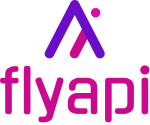

# flyapi

 

  

# About The Project

### Built with

## Documentation

Visit the Homepage - 

## License

Distributed under the MPL-2.0 License. See LICENSE.txt for more information.

## Contact

[@steelWinds](https://github.com/steelWinds) | kirillsurov0@gmail.com | [t.me/bladeVrtx](https://t.me/bladeVrtx)
